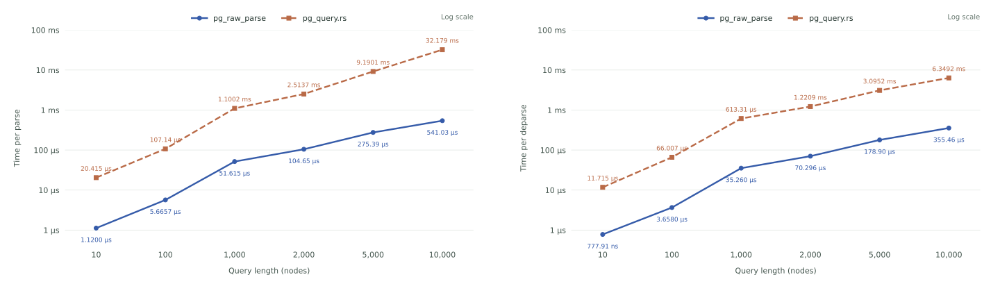

# pg_raw_parse

`pg_raw_parse` is a Rust library that provides direct access to the PostgreSQL parser. It's 20-60x faster (not a typo)
than [`pg_query.rs`](https://docs.rs/pg_query/latest/pg_query/) and uses 90% less memory (see [benchmarks](#benchmarks)).

The library is primarily used in [PgDog](https://github.com/pgdogdev/pgdog), but has no dependencies
except [`libpg_query`](https://github.com/pganalyze/libpg_query), so it can be used in any Rust application to quickly parse and manipulate PgSQL.

## Quick start

We don't regularly publish the crate to crates.io, so you should install it via git dependency instead:

```toml
# Cargo.toml
pg_raw_parse = { git = "https://github.com/pgdogdev/pg_raw_parse" }
```

This crate has a very similar API to `pg_query.rs`, e.g., to parse a query and get its AST, you can:

```rust
use pg_raw_parse::{parse, deparse, normalize};

let ast = parse("SELECT * FROM users WHERE id = $1").unwrap();
let query = deparse(&ast).unwrap();
let normalized = normalize(&ast).unwrap(); // Doesn't require parsing the query again!
```

## Why another crate

`libpg_query` uses Protobuf to provide access to its API to non-C languages, e.g., Rust, Ruby, Python, etc. This makes it very slow at runtime because it requires (de)serialization and additional memory allocations to pass the AST data structure across the FFI boundary.

`pg_raw_parse` uses macros to generate Rust structs directly on top of the PostgreSQL arena allocator. This ensures that calls to `pg_raw_parse::parse` require much fewer memory allocations, performed by the PostgreSQL memory context.

Since most code is generated, upgrading major PostgreSQL versions only requires bumping up the `postgres` and `libpg_query` submodules. This allows us to stay current with upstream changes without much effort.

You can read more about the crate's internals [below](#design).

## Benchmarks

You can reproduce our benchmarks [here](benchmarks). The following numbers are from my Mac M1 Max.



### Parse

```rust
let ast = pg_raw_parse::parse("SELECT 1").unwrap();
```

| Query size (nodes) | `pg_query.rs` | `pg_raw_parse` | Speedup |
| -----------------: | ------------: | -------------: | ------: |
|                 10 |     20.415 µs |      1.1200 µs |  18.23× |
|                100 |     107.14 µs |      5.6657 µs |  18.91× |
|              1,000 |     1.1002 ms |      51.615 µs |  21.32× |
|              2,000 |     2.5137 ms |      104.65 µs |  24.02× |
|              5,000 |     9.1901 ms |      275.39 µs |  33.37× |
|             10,000 |     32.179 ms |      541.03 µs |  59.48× |

### Deparse

```rust
let query = pg_raw_parse::deparse(&st).unwrap();
```

| Query length (nodes) | `pg_query.rs` | `pg_raw_parse` | Speedup |
| -------------------: | ------------: | -------------: | ------: |
|                   10 |     11.715 µs |      777.91 ns |  15.06× |
|                  100 |     66.007 µs |      3.6580 µs |  18.04× |
|                1,000 |     613.31 µs |      35.260 µs |  17.39× |
|                2,000 |     1.2209 ms |      70.296 µs |  17.37× |
|                5,000 |     3.0952 ms |      178.90 µs |  17.30× |
|               10,000 |     6.3492 ms |      355.46 µs |  17.86× |

### Normalize

```rust
let normalized = pg_raw_parse::normalize("SELECT 1").unwrap(); // SELECT $1
```

| Query length (nodes) | `pg_query.rs` | `pg_raw_parse` | Speedup |
| -------------------: | ------------: | -------------: | ------: |
|                   10 |     3.1349 µs |      2.4581 µs |   1.28× |
|                  100 |     16.974 µs |      11.776 µs |   1.44× |
|                1,000 |     144.84 µs |      108.65 µs |   1.33× |
|                2,000 |     289.67 µs |      221.25 µs |   1.31× |
|                5,000 |     767.01 µs |      550.07 µs |   1.39× |
|               10,000 |     1.4547 ms |      1.1976 ms |   1.21× |

## Working with ASTs

In addition to parsing queries, we provide mechanisms to [traverse an AST], [construct
new ASTs], and [transform ASTs].

Traverse a query to find its parameters:

```rust
use pg_raw_parse::{Node, parse, walk};

let ast = parse("SELECT $1, $2").unwrap();
walk::walk(ast.stmts().next().unwrap(), |node| {
    if let Node::ParamRef(param) = node {
        println!("${}", param.number);
    }
});
```

Construct a `SELECT $1` AST without parsing SQL:

```rust
use pg_raw_parse::{deparse, make, nodes};

let ast = make::owned(|mem| {
    let mut select = mem.make_node::<nodes::SelectStmt>();
    let target = mem.make_res_target(None, mem.empty(), mem.make_param_ref(1).uncast());
    select.as_mut().set_target_list(mem.make_list(&[target]));
    select
});
assert_eq!(deparse(&*ast).unwrap().as_str(), "SELECT $1");
```

Transform a copy of an AST, replacing a literal with a parameter:

```rust
use pg_raw_parse::{NodeMut, deparse, make, parse, transform};

let ast = parse("SELECT 42").unwrap();
let changed = make::owned(|mem| {
    let mut copy = mem.make_unique(ast.stmts().next().unwrap());
    transform::transform(&mut copy, |node| match &*node {
        NodeMut::A_Const(_) => {
            node.replace(mem.make_param_ref(1).uncast());
            None
        }
        _ => Some(node),
    });
    mem.make_raw_stmt(copy)
});
assert_eq!(deparse(&*changed).unwrap().as_str(), "SELECT $1");
```

[traverse an AST]: https://docs.rs/pg_raw_parse/latest/pg_raw_parse/walk/index.html
[construct new ASTs]: https://docs.rs/pg_raw_parse/latest/pg_raw_parse/make/index.html
[transform ASTs]: https://docs.rs/pg_raw_parse/latest/pg_raw_parse/transform/index.html

## Design

The primary goal of `pg_raw_parse` is to map to PostgreSQL's parser with as
little overhead as possible. This means mapping to the raw structures whenever
possible, using PostgreSQL's internal allocator, and avoiding any significant
copies of data.

PostgreSQL does not publish any header files or libraries to expose its backend
functions. We use [libpg\_query], which embeds those files in a form that is
easy to compile without going through CMake, as well as makes a few changes
to enable multithreaded usage. We also use this library for its `deparse`
implementation, turning an AST back into a string.

### Structs

When possible, the structures in this library are cast directly from a pointer
to the C structure.

The main exception to this is `Node *`, which is
semantically an unsized enum. There is no way to represent an enum with
different sizes for each variant in Rust, so we need our own wrapper enum.

The tag is identical to the tag of the C enum, so LLVM _should_ be able to optimize
this away in many cases but it is not guaranteed.

### Memory architecture

Everything in pg\_raw\_parse makes use of PostgreSQL's allocator, both for
manipulating the structures returned by `parse`, and for [constructors provided
by this library][construct new ASTs].

It is assumed that ASTs are retained at the scope of a single query. Each call to `parse` will return an AST with its
own arena.

Individual nodes do not implement `Drop`, and are not freed until the
entire arena is dropped. This can result in slightly higher memory usage when
mutating ASTs, as nodes that are replaced will still occupy memory.

The result is much less overhead from `palloc`/`pfree` in the most common usage
patterns.

### Memory safety

To ensure that fields of an AST node are always allocated on the same arena as
its parent, we make use of [lifetime branding].

[`MemoryToken`] is a type that
is used for constructing node allocated on a specific arena. Constructors
require all fields to be [`Unique`], which represents a node allocated on that
same arena and is not assigned anywhere else.

Once all construction/mutation is
complete, the result is wrapped in [`Owned`], which is responsible for freeing
the arena in its destructor.

[lifetime branding]: https://plv.mpi-sws.org/rustbelt/ghostcell/
[`MemoryToken`]: https://docs.rs/pg_raw_parse/latest/pg_raw_parse/make/struct.MemoryToken.html
[`Unique`]: https://docs.rs/pg_raw_parse/latest/pg_raw_parse/make/struct.Unique.html
[`Owned`]: https://docs.rs/pg_raw_parse/latest/pg_raw_parse/struct.Owned.html

Because individual nodes are never freed on their own, once an arena is inside
of an `Owned`, it is frozen. It is only possible to get shared references to
fields within it, and its arena can never be used for allocations again.

This decision was made to make it impossible to cause a memory leak by holding a long
lived reference to an AST, and then mutating it repeatedly. Instead, to mutate
an `Owned` node, it must first be copied onto a new memory arena using
[`make_unique`].

[`make_unique`]: https://docs.rs/pg_raw_parse/latest/pg_raw_parse/make/struct.MemoryToken.html#method.make_unique

The majority of the code in this library is generated from C header files, with
the exception of extremely generic code such as list manipulation. We first run
these header files through [bindgen], and then operate on the resulting code as
if it were a procedural macro.

Although this code lives in [build.rs](blob/main/build.rs), its patterns should be familiar to developers
familiar with writing procedural macros.

[bindgen]: https://github.com/rust-lang/rust-bindgen

### Memory layout

We create our own layout compatible structs rather than directly exposing the
structs generated by bindgen. This is to give us control over the visibility of
fields, as we don't want raw pointer fields to be public.

We generate accessor methods that convert to our custom type, and check the tag so an invalid node
assignment results in a panic rather than undefined behavior. In particular,
this is required for `Node*`, which cannot be represented in Rust as a simple
pointer cast for the reasons mentioned above.

### Compatibility

C has no concept of generics, so all lists are untyped lists of nodes. However,
many of those fields have documentation stating that they are a list of a single
type of node. We look for those comments, and change the type of the field to a
typed list if we find one.

[AST traversal][walk an AST] is done using PostgreSQL's internal
`raw_expression_tree_walker` function, with a thin wrapper to handle passing a
Rust closure to C and transform PostgreSQL's exceptions into Rust panics. [AST
transformation][transform ASTs] is done with generated code.

As a result of relying on code generation for the majority of this library,
supporting new PostgreSQL versions requires very little work. It is usually
nothing more than a submodule update for [libpg\_query], pointing to a commit
which includes the PostgreSQL source for that version.

## Comparison with pg_query.rs

The other popular library in this space is [pg\_query.rs], which is maintained
by the same team who maintains [libpg\_query]. While both libraries depend on
[libpg\_query] to get access to PostgreSQL's internal parser, [pg\_query.rs]
uses [libpg\_query]'s protobuf serialization layer to somewhat decouple it from
PostgreSQL's internal details. This type of approach makes sense when you're
maintaining bindings for multiple languages, but Rust's strong C FFI means a
lower level binding allows us to avoid many of the drawbacks of that approach.

We are able to avoid the overhead of protobuf de/serialization, as well as
memory cost of copying all those structures into a memory space controlled by
the global allocator. `protoc` also generates a fairly inefficient data
structure in this case, causing the `Node` enum to be 584 bytes large.

In contrast, by binding directly to PostgreSQL's data structures, there is no
memory overhead beyond what would be used either way within PostgreSQL's parser.
And the cost of "constructing" the Rust structures is at most a pointer cast and
a tag check. These two factors result in pg\_raw\_parse performing significantly
better, with the gap increasing as the size of the AST increases.

## Contributing

See [Contribution Guidelines](CONTRIBUTING.md).

## License

Licensed under either of these:

- Apache License, Version 2.0, ([LICENSE-APACHE](LICENSE-APACHE) or
  https://www.apache.org/licenses/LICENSE-2.0)
- MIT license ([LICENSE-MIT](LICENSE-MIT) or
  https://opensource.org/licenses/MIT)

### Prior art

- [libpg_query](https://github.com/pganalyze/libpg_query)
- [pg_query.rs](https://github.com/pganalyze/pg_query.rs)
